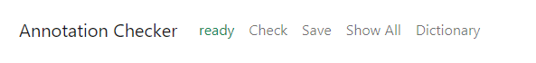
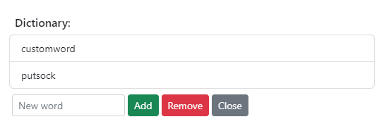
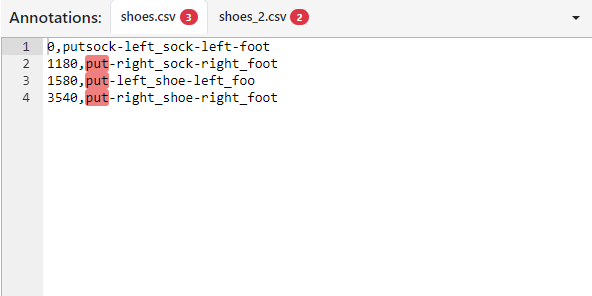
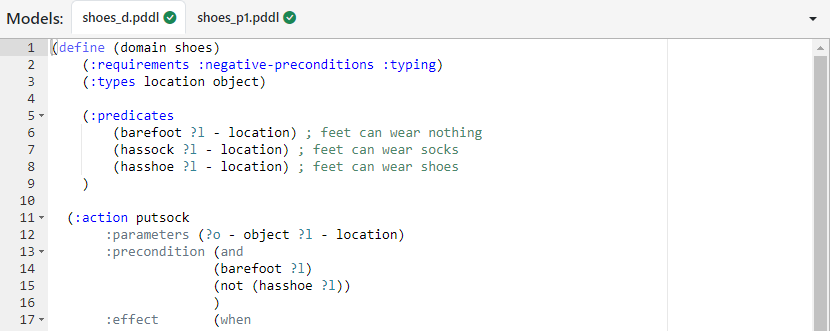
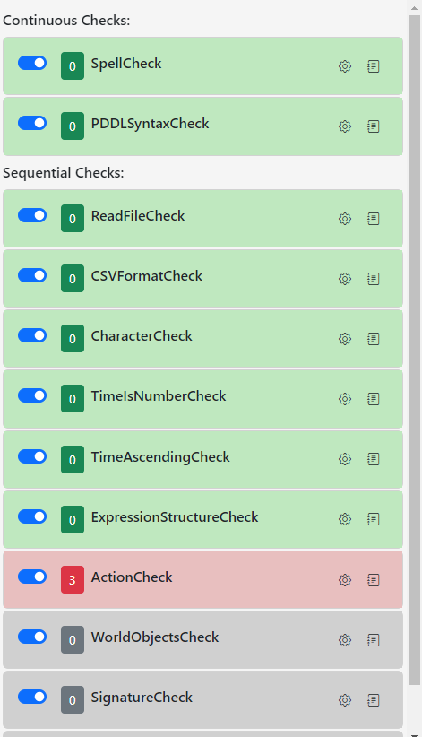

This work is licensed under a [Creative Commons Attribution-NonCommercial-ShareAlike 4.0 International License](https://creativecommons.org/licenses/by-nc-sa/4.0/). 


For details view the [Licence file](https://github.com/vac-mmis/CausalAnnotationCorrection/blob/main/LICENSE)!

---
# Causal Annotation Correction Tool
A tool support tool for inspection, validation and correction of behavioral annotations.

## Installation with Docker

- Install docker ([https://docs.docker.com/engine/install/](https://docs.docker.com/engine/install/))

Fast start the example:
1. Just run the image from docker hub:
    ```
    $ docker run -p 9000:9000 -it fgratzkowski/cac
    ```
2. Navigate to: `Examples/Checking_Annotation` or `Examples/Creating_Domain`
3. Simply invoke: `make run`

Use your own files:
1. On your system, navigate to the directory that contains the files you want to use (domain.pddl, problem.pddl, annotation.csv).
2. Run the image from docker hub:
    ```
    $ docker run -p 9000:9000  docker run -p 9000:9000 --mount type=bind,source=".",target="/home/cac/CausalAnnotationCorrection/OUTSIDE" -it fgratzkowski/cac -it fgratzkowski/cac
    ```
3. You will find your files in the `OUTSIDE` directory:
    ```
    $ cd OUTSIDE
    ```
4. Simply run the tool by invoking:
    ```
    $ acheck check $domain.pddl $problem.pddl $annotation.csv
    ```
   For more information check out the `Usage` section below.


---
## Installation
If you just want to use the tool independently of docker,
you can install the package via `pip`:
```
$ pip install acheck
```
The tool requires **Python 3.8** or higher. 
  - If you experience any issues, you may want to have a look at: https://docs.python-guide.

### Spell Checking
The tool uses `pyenchant` for spell checking. It is a spellchecking library for Python, based on the [Enchant](https://abiword.github.io/enchant/) library. In order to work properly you will need to install the Enchant C library manually:

**MacOS:** 
  ```
  $ brew update
  $ brew install enchant
  ```
To avoid problems, restart your system after installation.

**Linux:**\
The quickest way is to install `libenchant` using the package manager of your current distribution.\
To detect the libenchant binaries, PyEnchant uses `ctypes.util.find_library()`, which requires `ldconfig`, `gcc`, `objdump` or `ld` to be installed. This is the case on most major distributions, however statically linked distributions (like Alpine Linux) might not bring along `binutils` by default.\
To avoid problems, restart your system after installation.
   ```
   $ pacman -S enchant
   
   $ sudo apt-get install enchant-2
   ````

If you experience any issues, you may want to have a look at: 
> https://pyenchant.github.io/pyenchant/install.html

It can happen that with the Enchant installation, no providers are installed that enable the spell check. 
For this you can install the desired provider yourself:
```
$ pacman -S aspell

$ sudo apt-get install aspell
```
Also, the desired languages can be installed in this way:
```
$ pacman -S aspell-en
$ pacman -S aspell-de

$ sudo apt-get install aspell-en
$ sudo apt-get install aspell-de
```
If you experience any issues, you may want to have look at:
>https://pyenchant.github.io/pyenchant/install.html#installing-a-dictionary

The standard language for the spell checker is English (en_US). You need to configure the language with the following command:
```
$ acheck config -l $language
```
Supported languages (at the moment): `en_US` `en_GB` `de_DE`


### Plan Validation
If you want to enable plan validation, you need to download the [KCL Validator](https://github.com/KCL-Planning/VAL). Just follow the instructions on the GitHub page and download the binaries for you operating system. 
To get to the download, just click on the `Azure Pipelines` button at the beginning of the [README.md](https://github.com/KCL-Planning/VAL/blob/master/README.md). Save the binaries in a location that suits you.
After downloading, you need to configure the path to the validator executable file. `bin/Validate` or `bin/Validate.exe`

In order to use the plan validator correctly, stop the tool and set the path like:
```
$ acheck config -v $path-to-validate-executable
```
Examples:
```
$ acheck config -v /Users/macos64/Val-20211204.1-Darwin/bin/Validate
$ acheck config -v /Users/linux/Val-20211204.1-Linux/bin/Validate
$ acheck config -v /Users/windows/Val-20211204.1-Windows/bin/Validate.exe
```
---

# Usage
After the package has been installed, just use:

```
$ acheck check $domain.pddl $problem.pddl $annotation.csv
```

By default, it will automatically start a local server on [127.0.0.1:9000](http://127.0.0.1:9000/).

#### Options:  
- `-l $file_1 $file_2 $file_n` : Enter one or multiple annotation files or the domain or problem file to lock them in editor
    ```
    $ acheck check domain.pddl problem.pddl anno_1.csv -l domain.pddl anno_1.csv
    ```

- `-o $directory`: Enter a custom directory for all output files. 
    ```
    $ acheck check domain.pddl problem.pddl anno_1.csv -o project/output
    ```
- `-p port`: Specify the `port` on which the server is running. 
    ```
    $ acheck check domain.pddl problem.pddl anno_1.csv -p 8000
    ```
- `-v`: Enable verbose output. 

- `-m directory`: Enter a custom `directory` to load multiple annotations

- `--nogui`: For command line only use. 

- `--inplace`: Work with the original files. For command line only use without backup. 
   

---
# Structure

### Navbar



Click on `Check` to check the annotation. `Save` will save all changes that were made.\
`Show All`displays all errors found for the given annotation and model inside the output window.\
Click on `Dictionary` to open the dictionary.

### Dictionary

With the `Dictionary` you can tell the spell check to include or exclude words. 
Inside the dictionary, enter a word and click add to add it to the dictionary. Click on words that has been added to select them and click 'Remove' to delete them from the dictionary.

### Annotation Editor



Here you can see all open annotations. You can click on the tabs to switch between multiple loaded annotations.
The errors that were found during the check are highlighted. Click on them for further information. 
You will also get advices for fixing the errors if possible. 
You can select the line limit to have only a certain number 
of lines checked by clicking on the desired number of lines 

### Model Editor



Inside the model window you can view and edit the domain and problem file. 

### Check Options



The `Checks` panel contains information for each check applied to the annotation.
The checks are divided into two groups:  \
`Continuous Checks` are running everytime you press check. \
`Sequential Checks` are executed one after another. If a check throws an error, the checking process will stop. 
    It will move on if all error thrown by the actual checker are fixed.

You can toggle them off to deactivate them during the checking process. 
The gear button opens the menu for configuring the check.
The second button shows the log that is potentially generated during the execution. 
Click on the colored badge that shows the number of errors found by this check to automatically scroll to the first error found. 
Green means no errors. Yellow means there are only warnings, but they do not disturb the general process. 
Red means errors have been found that need to be taken care of.

### Output


The Output window displays all errors found in the clicked section of the annotation. If you click on one, you will get a selection of correction suggestions and information about the error. These are:
- ReplaceSequence: \
Replaces the section with a suggestion
- RemoveSequence: \
Removes the sequence
- WhitelistSignature: \
Saves the signature of an action as the active signature. Same actions with more or less parameters, are now marked as errors.
- Alert: \
Outputs more information about the error.
- AdaptModel: \
If you want to adapt the model, for example by adding actions or objects, AdaptModel copies a template to the clipboard, which you can directly take over and adapt afterwards.


### Resetting the tool
If you want to reload the original files just delete the output folder and restart the tool, otherwise the tool will always refer to the 
saved backup that was created on the first start.
---
# Clone and prepare for development
Clone the repository and navigate into the `annotation-checker` directory. Now you will need to install all packages that do not come with python.

- If you want to use `Pipenv`, make sure you are in the repository folder and run:
	```
	$ pipenv shell
	$ pipenv install -e .
	```

- If you want to use your own virtual environment:
	```
	$ python -m pip install -r requirements.txt
	$ python -m pip install -e .
	```

This will install the module together with all other packages needed.

If you need some help with virtual environments, have a look at: 
https://packaging.python.org/en/latest/guides/installing-using-pip-and-virtual-environments/

Get further information and documentation at:
sphinx documentation page

---

If you have further questions, feel free to create an [issue](https://github.com/vac-mmis/CausalAnnotationCorrection/issues/new) or contact me at [felix.gratzkowski@uni-rostock.de](felix.gratzkowski@uni-rostock.de).